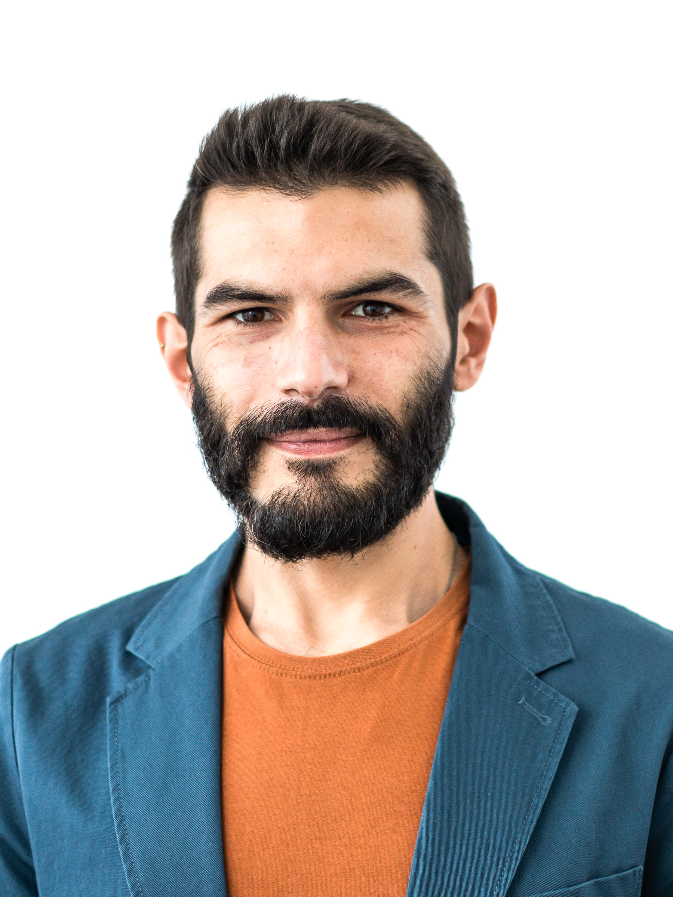

<h1> Ivan Palmegiani, MSc </h1>

#### Berlin - Germany
<ivan.palmegiani@gmail.com> | [LinkedIn Account][2d6409ca]  |  [GitHub Account][e3281462]  
Phone number and address available on request

  [2d6409ca]: https://www.linkedin.com/in/ivan-palmegiani-13a4a15b/ "My_LinkedIn"
  [e3281462]: https://github.com/IvanPalm "My_GitHub"

  

## Profile
Scientist with strong analytical mindset and very good organization skills. Advanced technical capabilities developed over 5+ years working experience, and intensive training. Excellent communication skills. Team worker, also able to take charge of tasks individually. Highly motivated and positive towards challenges. Solution oriented, and careful about details. Constructive critical thinker. Curious and eager to learn.

### Expertise
R coding | Python programming | Relational (geo)databases (SQL and PostGreSQL) | Geographic Information Systems (GIS) | Exploratory data analyses (EDA) | Hypothesis testing | Inferential and predictive modelling | Time series analyses and forecast | Data visualization | Data reporting | Research

## Professional Experience  
**Freelance Data Scientist | Quantitative Analyst**, June 2018 - Present  

[IZW - Leibniz Institute for Zoo and Wildlife Research][bb58fb82]  
**PhD Candidate**, May 2014 - Jun. 2018 | **Research Assistant**, Apr. 2013 - Sept. 2013  
Main goal: Investigating the mating system of freeranging cheetahs in central Namibia.  
Main tasks: Collect and analyze long time series of geo-referenced and telemetry data with Kernel Density Estimation (KDE), Movement-based KDE (MKDE), Brownian Bridges Movement Models (BBMM), Local Convex Hulls (LoCoH), K-nearest neighbors algorithms (k-NN), Random-walks. EDA and model environmental dynamics with linear and non-linear regression models. Collect and analyze presence-absence data via camera-trapping surveys. Design and maintain relational geo-databases in PostGreSQL. Data visualization and report to stake-holders, team members, and scientific audiences. Organize and supervise data collection in the field. Write scientific papers. Organize scientific symposia.  

[CIBIO - Research Center in Biodiversity and Genetic Resources ][87111420]  
**Research Assistant**, Dec. 2012 - Feb. 2013 | **Research Technician**, Feb. 2012 - Nov. 2012    
Main goal: Investigate the spatial ecology of freeranging wolves, and predator-prey relationship in Peneda-Gerês National Park (PT).  
Main tasks: Collect and analyze GPS telemetry and geo-referenced environmental data. EDA and model presence-absence data with generalized linear models (GLM). Design and maintain relational geo-databases. Report data to stake-holders, team members, and scientific audiences. Write scientific papers.   

[Department of Zoology and Evolutionary Genetics, University of Sassari][09879b80]    
**Research Technician**, Nov. 2010 - Nov. 2011  
Main goal: Investigate spatial distribution, reproductive success, and predator-prey relationship of freeranging wolves in Arezzo Province - Tuscany (IT).  
Main tasks: Collect geo-referenced environmental data. Collect and analyze bio-acoustic data. Collect and analyze presence-absence data via camera-trapping surveys. __Teaching experience__: lecturer on wildlife survey/monitoring methods.  

  [bb58fb82]: http://www.izw-berlin.de/welcome.html "IZW"
  [87111420]: https://cibio.up.pt/ "CIBIO"
  [09879b80]: https://en.uniss.it/ugov/person/2348 "UniSS"

## Education
**Master of Science (MSc)**, Jul. 2010  
*Environmental science and natural resources management*, University of Sassari. Grade: 110/110 *cum Laude*  
Environmental modelling, statistical inference, advanced statistical theory, zoocenosis and wildlife conservation, wildlife management, genetics, plant conservation, environmental economics, systems ecology, landscape ecology, regional geology, sedimentology.

**Bachelor of Science (BSc)**, Feb. 2008    
*Environmental Science*, University of Perugia. Grade: 107/110  
Principles of biology, geology and ecology. The course of study covered a wide range of subjects to provide the students with the solid background required to undertake ecological and environmental studies.

## Further training
**Data Science Bootcamp**, Aug. 2019 - Nov. 2019   
*Business Trends Academy*  
Data protection and ethical matters | Linear and non-linear regression | A/B testing | Hypothesis testing | Data visualization in Tableau | Object oriented programming (OOP) | Python modules and functions | Pandas and NumPy | Multiprocessing and multithreading | RESTful API | Webscraping | Neural Networks and Machine Learning techniques | Keras, Anaconda and TensorFlow.

**Movement Ecology Summer School**, Aug. 2015   
*Population Ecology Research Group, University of Zurich*  
GIS and remote sensing in R | Characterization of movement trajectories | Home range analysis | Habitat selection modelling | Integration of data from alternative sensors and future perspectives.

**Next Generation Data Management in Movement Ecology**, Jul. 2015   
*IRSAE, International Research School in Applied Ecology - FEM, Edmund Mach Foundation*  
Spatial database management in PostgreSQL/PostGIS | Movement data analysis in R

**Multivariate Data Analysis for Ecology and Evolution in R**, Nov. 2012   
*CIBIO - Research Center in Biodiversity and Genetic Resources*
Explanatory methods (PCA, PcoA, MDS, clustering) | Inferential methods (Randomization, bootstrap, jackknife, Monte Carlo statistics, multivariate, GLM, PLS, CanCor, Mantel Test) | Evolutionary and ecological Non-Independence (PGLS, PIC, rates of change, spatial autocorrelation, spatial GLS) | Model selection (i.e. Hypothesis testing vs information criteria) | Analysis of dispersion (i.e. Convex hulls area/volume, nearest neighbour, centroid size, eccentricity).  

**BiostAT 2011 – Statistic inference in Biology and Human Sciences**, Jun. 2011   
*UniASTISS, Department of Statistics - Purdue University, Department of Economy - UniMORE, Italian Institute for Philosophical Studies, Department of Statistics - Bologna University, Department of Human and Animal Biology - University of Turin, Department of Social Research - University of Eastern Piedmont, Asti Association for Scientific and Technological Development*  
Linear and non-linear regression models | Non-parametric regression model
| Principal components analysis | Factor analysis | Correspondence analysis | Cluster analysis | R coding.

### Languages

English (IELTS certification level C1) • German (TELC certification level B1) • Italian (mother tongue) • Spanish (fluent) • Portuguese (fluent).

### Hobbies and interests  
Outdoor sports and activities such as climbing, bouldering, hiking, biking, canoeing, camping • Indoor gardening • Urban farming • DIY and Handicraft • Music and Arts.

## References

[**Alexandre Courtiol, PhD**][5e81c0d6] Senior Researcher at [IZW - Leibniz Institute for Zoo and Wildlife Research][bb58fb82]  
<alexandre.courtiol@gmail.com>   
[**Ilja Heckmann, PhD**][d56ee8a1] Data Protection Coordinator at [IZW - Leibniz Institute for Zoo and Wildlife Research][bb58fb82]  
<ilja.heckmann@gmail.com>  
[**Laura Iacolina, PhD**][01142937] Assistant Professor at [University of Primorska][58569d71]  
<lauraiacolina@gmail.com>

  [5e81c0d6]: https://www.linkedin.com/in/alexandre-courtiol-538b5a185/?originalSubdomain=de "AlexCourtiol"
  [01142937]: https://www.linkedin.com/in/laura-iacolina-7710a525/ "LaurinaIacolina"
  [58569d71]: https://www.famnit.upr.si/en/ "UniPrimorska"
  [d56ee8a1]: http://www.izw-berlin.de/heckmann-ilja.html "IljaHeckmann"
