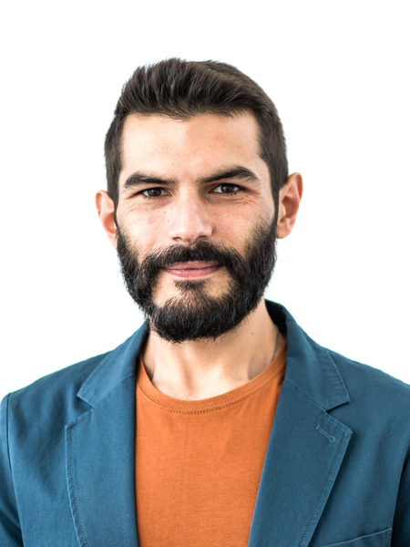

<h1> Ivan Palmegiani, MSc </h1>

**<ivan.palmegiani@gmail.com> | [LinkedIn Account][2d6409ca]  |  [GitHub Account][e3281462]**   
Address and phone number available on request

  [2d6409ca]: https://www.linkedin.com/in/ivan-palmegiani-13a4a15b/ "My_LinkedIn"
  [e3281462]: https://github.com/IvanPalm "My_GitHub"

  
  

<h2> Profile </h2>

Researcher with cross-disciplinary expertise extending from natural sciences to machine learning. Earth Observation enthusiast. Proponent of nature-based solutions for climate change adaptation and mitigation. Capable of getting actionable insights from numerical results. Team player, also able to take charge of tasks individually. Constructive critical thinker. Highly motivated and positive towards challenges. Strong analytical mindset and excellent organization skills. Solution oriented and careful about details. Curious and eager to learn.

<h3> Technical expertise </h3>

Python programming | R coding | Geographic Information System - QGIS and geospatial Python libraries | Relational (geo)databases - PostgreSQL-PostGIS | Remote Sensing - GEE Python API | Machine Learning | Geodata analyses | Time Series analyses | Data visualization | Data reporting - Jupyter and RMarkdown frameworks

<h3> Languages </h3>

English - IELTS certification level C1 • German - TELC certification level B1 • Italian - mother tongue • Spanish - fluent • Portuguese - fluent

<h2> Professional Experience </h2>

**Environmental Researcher | (Geo)Data Scientist**, Nov. 2019 - Present  
[SmartCloudFarming GmbH (DE)][2dg5i84s] Mar. 2020 - present  
Research and development in production context, i.e. developed data science pipelines any python programs to source ground data and satellite imaging, and to prepare data for machine learning algorithms. Co-developed and fine-tuned ML models to predict percent soil moisture at field level down to 45 cm depth from satellite data. The accuracy of predictions is satisfactory (R squared > 0.95, RMSE < 5%). Generated interactive data visualizations, and prepared data reports.  

Bibliographical research to identify state-of-the-art methods for the estimation of soil organic carbon from multispectral and hyperspectral satellite imaging. Screening of texts was performed with NLP algorithms. Selected manuscripts were read by human-eyes. ML approaches have been employed to generate reports of key contents

[EarthRatings UG (DE)][sf46gh40] Nov. 2019 - Jun. 2020   
Web research on public data sets on Corporate Environmental Footprint (CEF) and Social Responsibility (CSR) | Development of a web scraper (Scrapy, Selenium and headless browser) to source publicly available data | Conversion of raw material to 'Tidy Data' | Exploratory data analyses

[University of Primorska (SL)][bv7kewda]  Nov. 2019  
Data cleansing | Development of functional solutions for data storage in relational databases, using Microsoft products | Data querying in SQL | Consulting on wildlife data management

**Professional re-qualification**, Oct. 2018 - Nov. 2019  
Data Science and Python programming courses | German language course | Conflict management and non-violent-communication (NVC) self-training | Personal development

**PhD Candidate**, May 2014 - Jun. 2018 | **Research Assistant**, Apr. 2013 - Sept. 2013  
[IZW - Leibniz Institute for Zoo and Wildlife Research (DE)][bb58fb82]  
Investigating the social system of the cheetah in central Namibia  
- Collected, processed and analyzed time series of geospatial data from satellite telemetry
- Performed spatial and movement analyses on tracking data using adehabitat packages
- Modelled the use of space by individuals with linear and nonlinear regression models
- Collected and analyzed presence-absence data via camera-trap surveys
- Designed and maintained online and offline (geo)databases
- Engaged with stakeholders, and presented scientific results to the general public  through talks, visualizations and reports
- Coordinated data collection in the field, supervised volunteers
- Organized scientific symposia  

**Research Assistant**, Dec. 2012 - Feb. 2013 | **Research Technician**, Feb. 2012 - Nov. 2012    
[CIBIO - Research Center in Biodiversity and Genetic Resources (PT)][87111420]  
Investigating the spatial ecology of endangered wildlife species in the Iberian peninsula (Portugal and Spain)  
- Collected and analyzed satellite telemetry and environmental data
- Modelled species distribution in relation to environmental variables using linear and nonlinear regression models
- Designed and maintained relational (geo)databases

**Research Technician**, Nov. 2010 - Nov. 2011  
[Department of Zoology and Evolutionary Genetics, University of Sassari (IT)][09879b80]    
Investigating spatial distribution, abundance and reproductive success of wolves in central Italy  
- Collected data on the presence-absence of wolves, and environmental variables   
- Collected presence-absence data via camera-trap surveys
- Modelled presence-absence of wolves with multilinear regression models
- Collected and analyzed bio-acoustic data

  [2dg5i84s]: https://smartcloudfarming.com/ "SCF"
  [sf46gh40]: https://www.earthratings.com/ "ERs"
  [bv7kewda]: https://www.famnit.upr.si/en/ "UniPRIS"
  [bb58fb82]: http://www.izw-berlin.de/welcome.html "IZW"
  [87111420]: https://cibio.up.pt/ "CIBIO"
  [09879b80]: https://en.uniss.it/ugov/person/2348 "UniSS"

<h2> Education </h2>

**Master of Science (MSc)**, Jul. 2010  
*Environmental Sciences and Natural Resources Management*, University of Sassari. Grade: 110/110 *cum Laude*  
Environmental modelling, statistical inference, advanced statistical theory, systems ecology, landscape ecology, regional geology, pedology, sedimentology, zoocenosis and wildlife conservation, wildlife management, genetics, plant conservation, environmental economics

**Bachelor of Science (BSc)**, Feb. 2008    
*Environmental Sciences*, University of Perugia. Grade: 107/110  
Principles of biology, ecology, and geology. The course of study covered a wide range of subjects to provide the students with the solid background required to undertake ecological and environmental studies

<h2> Further training </h2>

**Copernicus MOOC**, Sept. 2020 - *ongoing*  
*Copernicus programme, from European Union and European Space Agency*  
Overview on the programme | Copernicus data and services | Renewable Energy | Security and Emergency Management | Resource Management | Land Use and Management | Air quality, water pollution and ecosystem health monitoring | Integrating Copernicus data with other sources: Machine Learning, AI | Ideation | Prototyping | Developing | Collaboration  

**e-Learning on Digital Agriculture**, Aug. 2020  
*Open Learning Campus, World Bank Group*  
Overview of Digital Agriculture | ICT and Digital Tools for Enhancing Productivity on the Farm | Empowering Smallholder Farmers through ICT/Digital Tools in Financial Services | Strengthening Agricultural Market Access with ICT and Digital Tools | Using ICT for Remote Sensing, Crowdsourcing, and Big Data

**Echoes in Space**, July 2020  
*EO College, European Space Agency - Friedrich-Schiller-Universität Jena*  
History of Radar technology and the discovery of electromagnetic waves | Image acquisition | Geometry of airborne and space borne Radar systems | Land applications of Radar remote sensing | Applications of radar remote sensing over Water | Application of Radar remote sensing for Hazard management

**Data Science Bootcamp**, Aug. 2019 - Nov. 2019   
*Business Trends Academy*  
Data protection and ethical matters | Linear and nonlinear regression | A/B testing | Hypothesis testing | Data visualization in Tableau | Object oriented programming (OOP) | Python modules and functions | Pandas and NumPy | Multiprocessing and multithreading | RESTful API | Webscraping | Neural Networks and Machine Learning techniques | Keras, Anaconda and TensorFlow

**Movement Ecology Summer School**, Aug. 2015   
*Population Ecology Research Group, University of Zurich*  
GIS and remote sensing in R | Characterization of movement trajectories | Home range analysis | Habitat selection modelling | Integration of data from alternative sensors and future perspectives

**Next Generation Data Management in Movement Ecology**, Jul. 2015   
*IRSAE, International Research School in Applied Ecology - FEM, Edmund Mach Foundation*  
Spatial database management in PostgreSQL/PostGIS | Movement data analysis in R

**Multivariate Data Analysis for Ecology and Evolution in R**, Nov. 2012   
*CIBIO - Research Center in Biodiversity and Genetic Resources*  
Explanatory methods (PCA, PcoA, MDS, clustering) | Inferential methods (Randomization, bootstrap, jackknife, Monte Carlo, GLM, PLS, CanCor, Mantel Test) | Evolutionary and ecological Non-Independence (PGLS, PIC, rates of change, spatial autocorrelation, spatial GLS) | Model selection (i.e. Hypothesis testing vs information criteria) | Analysis of dispersion (i.e. Convex hulls area/volume, nearest neighbor, centroid size, eccentricity)  

**BiostAT 2011 – Statistic inference in Biology and Human Sciences**, Jun. 2011   
*UniASTISS, Department of Statistics - Purdue University, Department of Economy - UniMORE, Italian Institute for Philosophical Studies, Department of Statistics - Bologna University, Department of Human and Animal Biology - University of Turin, Department of Social Research - University of Eastern Piedmont, Asti Association for Scientific and Technological Development*  
Linear and nonlinear regression models | Non-parametric regression model
| Principal components analysis | Factor analysis | Correspondence analysis | Cluster analysis | R coding

<h3> Hobbies and interests </h3>  
Cooking • Indoor gardening • Tai Chi • Outdoor sports and activities such as climbing, bouldering, hiking, biking, canoeing, camping • DIY and Handicraft • Music and Arts • Urban agriculture
