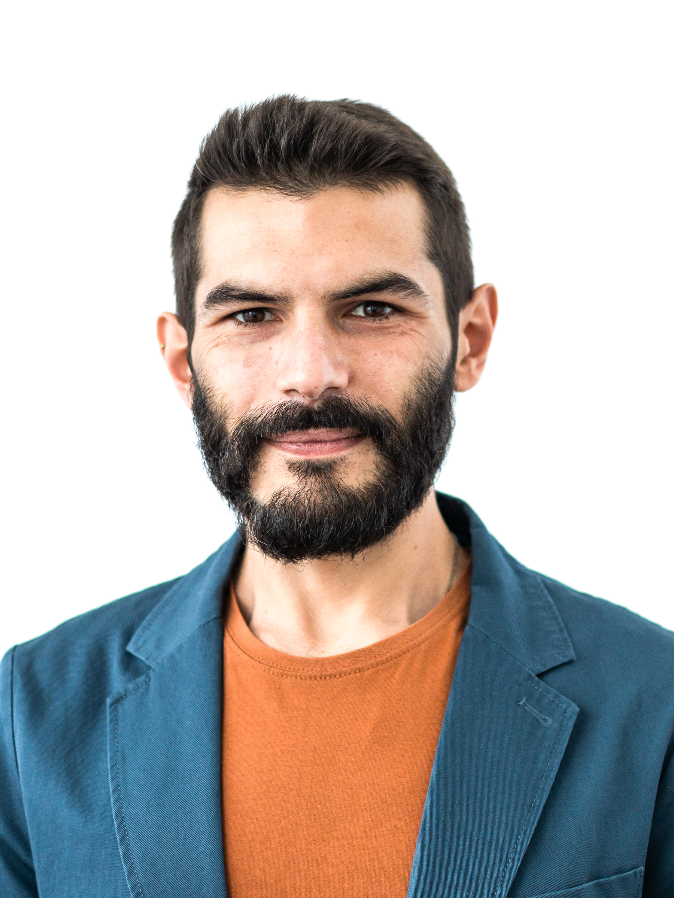

<h1> Ivan Palmegiani, MSc </h1>

**<ivan.palmegiani@gmail.com> | [LinkedIn Account][2d6409ca]  |  [GitHub Account][e3281462]**   
Personal address and phone number available on request

  [2d6409ca]: https://www.linkedin.com/in/ivan-palmegiani-13a4a15b/ "My_LinkedIn"
  [e3281462]: https://github.com/IvanPalm "My_GitHub"

  
  

<h2> Professional Profile </h2>

My expertise results from the fusion of ecosystem thinking and technical skills.

I hold expert knowledge and professional experience in several disciplines such as biodiversity and wildlife monitoring, landscape ecology, as well as water and soil management. I'm familiar with European Union directives, and well informed about international initiatives and partnerships aiming at the conservation, restoration, and sustainable management of natural resources.

I can identify, collect and analyse quantitative data as well as satellite imagery to address pressing environmental issues involving land ecosystems, and make sense of the numerical results to identify risks and opportunities inherent each case study.

<!-- 
<h3> Technical Skills </h3>
 -->
<table align=center><tr><td>
 <table align=left>
  <tr>
    <th>Technical Skills</th>
    <th> </th>
  </tr>
  <tr>
    <td>QGIS</td>
    <td>Advanced</td>
  </tr>
  <tr>
    <td>Python for Geospatial Analysis</td>
    <td>Advanced</td>
  </tr>
  <tr>
    <td>R Spatial, Stats and Charts</td>
    <td>Advanced</td>
  </tr>
  <tr>
    <td>Conda Management</td>
    <td>Advanced</td>
  </tr>
  <tr>
    <td>PostgreSQL-PostGIS</td>
    <td>Intermediate</td>
  </tr>
  <tr>
    <td>Google Earth Engine</td>
    <td>Intermediate</td>
  </tr>
  <tr>
    <td>Linux Bash & CLI Tools</td>
    <td>Intermediate</td>
  </tr>
  <tr>
    <td>Containerization in Docker</td>
    <td>Beginner</td>
  </tr>
  </table> 
</td><td>
 <table align=right>
  <tr>
    <th>Organizational Skills</th>
    <th> </th>
  </tr>
  <tr>
    <td>Self-Motivation</td>
    <td>Exceptional</td>
  </tr>
  <tr>
    <td>Physical & Mental Organization</td>
    <td>Excellent</td>
  </tr>
  <tr>
    <td>Problem Solving</td>
    <td>Excellent</td>
  </tr>
  <tr>
    <td>Critical Thinking</td>
    <td>Excellent</td>
  </tr>
  <tr>
    <td>Communication</td>
    <td>Very good</td>
  </tr>
  <tr>
    <td>Prioritization</td>
    <td>Very good</td>
  </tr>
  <tr>
    <td>Planning</td>
    <td>Very good</td>
  </tr>
  <tr>
    <td>Teamwork</td>
    <td>Very good</td>
  </tr>
</table> 
</td></tr></table>

<h3> Languages </h3>

English - Fluent (IELTS C1) • Italian - Native • Spanish - Fluent • Portuguese - Fluent • German - Intermediate (TELC B1)

<h2> Professional Experience </h2>

**Research Fellow** at [PlanAdapt Climate Co-Adaptation Lab][sbgr7oig]  
Fellowship, *Apr. 2021 - ongoing*   
Proposal development with focus on GIS and Earth Observation technologies for the design of Nature-Based Solutions.  

**Geospatial Data Consultant** at [WWF Water Risk Filter][8hbi6ucv]  
Contract, *Feb. 2021 - ongoing*  
Working closely with the technical project manager, I review methodologies for corporate water risks assessment and scenarios analysis, and design data visualizations and water risk maps for efficient data communication in stakeholder engagement. I'm in charge for the automation of data analysis and reporting workflows.

Tech stack: R Spatial, Tidyverse, R-Plotly, OfficeR, RStudio, MS Office, Conda, Git & GitHub.

**Geospatial Data Scientist** at [SmartCloudFarming GmbH][2dg5i84s]  
Contract, *Mar. 2020 - Feb. 2021*  
Research and development in a production context: following the principles of agile development, I have coordinated a small team of data professionals and personally worked at the development of a minimum viable product (MVP) for the estimation of water content in agricultural soil.

- Performed literature research to identify state-of-the-art methods for the estimation of soil water content and soil organic carbon from satellite imagery
- Presented key findings in bibliographical reports
- Identified suitable data sources to facilitate programmatic access to satellite imagery, and to ground data  
- Developed data science pipelines to source and composite satellite imagery to train machine learning (ML) models, and prepared ground data to test and validate predictions
- Co-developed and fine-tuned ML models to predict soil moisture content from satellite data. The accuracy of predictions is satisfactory (R squared > 0.95, RMSE < 0.05)
- Generated interactive data visualizations and 3D maps to report model predictions to executives
- Developed dashboards to display ground data and model predictions to investors, and to potential clients  

Tech stack: Python Spatial Modules, Jupyter, QGIS, Google Earth Engine, Scikit Learn, 
  Python-Plotly, Streamlit, Conda, Git & GitHub, Docker, PostgreSQL-PostGIS, Google Cloud Platform, Google App Engine.

**Data Consultant** at [Earth Ratings UG][sf46gh40]  
Contract, *May 2020 - Jun. 2020*  
Explored CDP data and methodologies | Identified and sourced additional data sets on Corporate Environmental Footprint (CEF) and Social Responsibility (CSR) | Developed a web scraper program to source publicly available data in accordance with the respective terms of use | Converted raw contents to tabular formats and integration of open data sets from several sources | Exploratory analyses and visualization of the resulting data sets

Tech stack: all technical work was performed in Python

**Data Management Consultant** at [University of Primorska][bv7kewda]  
Contract, *Jan. 2020*    
The role implied the revision of data storage procedures at the Conservation and Population Genetic research group. The tasks included cleansing of genetic data sets and migration from data sheets to database tables, development of functional solutions for data storage in relational databases, automating data querying, and advising the research team on wildlife data management.
The work has been conduced using open-source software for data cleansing and manipulation, while proprietary database solutions (Microsoft Access) have been used for data storage.

Tech stack: data munging in Python, user interfaces for data entry were generated with Microsoft Access

**Professional re-qualification**  
*Oct. 2018 - Nov. 2019*  
Data Science and Python programming courses | German language course | Conflict management and non-violent-communication (NVC) self-training | Personal development

**Graduate Research Assistant** at [Leibniz Institute for Zoo and Wildlife Research][bb58fb82]  
Full-time, *Apr. 2013 - Jun. 2018*  
Investigating the behavioural ecology of the cheetah in central Namibia

Desk research activities:
- Development of data collection protocols
- Field project management
- Planning and supervising field campaigns for the live-capture of cheetahs
- Spatial and movement analyses of high-resolution GPS-telemetry data
- Modeling distribution of the species and its use of space
- Modeling individual movement patterns and interactions
- Data management in [Movebank][owhfeo7h]
- Design and maintenance of PostgreSQL-PostGIS database
- Formulation and statistical testing of evolutionary hypothesis
- Presenting scientific results to the general public through talks, data visualizations and reports
- Organization of scientific symposia

Field activities:
- Executing live-capture campaigns of cheetahs using custom-build box traps
- Assisting in the live-capture of leopards using custom-build box traps
- Collected and analyzed presence-absence data via camera-trap surveys
- Engaged with local communities and stakeholders for the mitigating human-wildlife conflict
- Coordinated data collection in the field, supervised technicians and volunteers

**Graduate Research Assistant** at [CIBIO - Research Center in Biodiversity and Genetic Resources][87111420]  
Full-time, *Feb. 2012 - Feb. 2013*  
Investigating the spatial ecology of endangered wildlife species in the Iberian peninsula (Portugal and Spain)  

Field activities:
- Undertaking live-capture campaigns of wolves
- Collecting presence-absence data along transects and via camera-trap surveys
- Engaging with rural communities in the attempt to mitigate human-wildlife conflict

Desk research activities:
- Modeling species habitat, distribution and use of space with statistical learning models

**Graduate Research Assistant** at [Department of Zoology and Evolutionary Genetics, University of Sassari][09879b80]  
Full-time, *Nov. 2010 - Nov. 2011*    
Investigating spatial distribution, abundance and reproductive success of wolves in central Italy

Field activities:
- Undertaking live-capture campaigns of wolves
- Estimating pack size and reproductive success via wolf-howling surveys
- Collecting presence-absence data along transects and via camera-trap surveys
- Engaging with rural communities in the attempt to mitigate human-wildlife conflict

Desk research activities:
- Biocustical analysis of wolves vocalizations
- Ensuring proper storage and management of GIS data

  [sbgr7oig]: https://www.plan-adapt.org/climate-co-adaptation-lab/ "PlanAdapt"
  [8hbi6ucv]: https://waterriskfilter.panda.org/ "WRF-WWF"
  [2dg5i84s]: https://smartcloudfarming.com/ "SCF"
  [sf46gh40]: https://www.earthratings.com/ "ERs"
  [bv7kewda]: https://www.famnit.upr.si/en/ "UniPRIS"
  [bb58fb82]: https://www.izw-berlin.de/en/home.html "IZW"
  [87111420]: https://cibio.up.pt/ "CIBIO"
  [09879b80]: https://en.uniss.it/ugov/person/2348 "UniSS"
  [owhfeo7h]: https://www.movebank.org/cms/movebank-main "Movebank"

<h2> Education </h2>

**Master of Science (MSc)**, Jul. 2010  
*Environmental Sciences and Natural Resources Management*, University of Sassari.  
Grade: 110/110 *Summa cum Laude*  
Systems ecology, landscape ecology, regional geology, pedology, sedimentology, wildlife conservation and management, conservation genetics, environmental modeling, statistical inference, advanced statistical theory, environmental economics  

**Bachelor of Science (BSc)**, Feb. 2008  
*Environmental Sciences*, University of Perugia.   
Grade: 107/110  
Principles of biology, geology and ecology. The course of study covered a wide range of subjects to provide students with the solid background required to undertake ecological and environmental studies.

<h2> Training courses </h2>

**Advanced QGIS** with [Official Certification][abj5ok2], Sept 2021  
*Spatial Thoughts*  
Modeling and Automating GIS Workflows | Visualizing Time Series and 3D Data | Advanced Expressions

[abj5ok2]: https://changelog.qgis.org/en/qgis/certificate/QGIS-2360/

**ARSET - Species Distribution Modeling with Remote Sensing**, Aug. 2021  
*Applied Remote Sensing Training Program, NASA*  
Overview of Species Distribution Models (SDMs) | Data Sources for Species Distribution and Remote Sensing Data for Landscape Characterization | Tools for conducting SDM for a variety of ecosystems such Wallace R-based platform for modeling of species niches and distributions

**ARSET - Using Google Earth Engine for Land Monitoring Applications**, Jun. 2021   
*Applied Remote Sensing Training Program, NASA*  
Navigate the GEE interface to explore remote sensing datasets relevant to land monitoring | Execute JavaScript commands to retrieve satellite data and process imagery for analysis | Complete a supervised land classification along with an accuracy assessment in GEE | Apply algorithms to derive a time series of environmental parameters and calculate differences between years to detect landscape changes | Illustrate the capabilities of cloud-based raster computing for land management applications

**ARSET - Satellite Observations and Tools for Fire Risk, Detection, and Analysis**, May 2021  
*Applied Remote Sensing Training Program, NASA*  
Terminology regarding type and components of fire (pre, during, post) | Climatic and biophysical conditions pre-, during-, and post-fire | The satellites and instruments used in conducting fire science | The applications of passive and active remote sensing for fires | How to visualize fire emissions and particulate matter | The use of tools for active fires, emissions, and burned areas | How to acquire data for conducting analysis in a given study area

**Copernicus MOOC**, Sept. 2020 - Dec. 2020  
*Copernicus programme of European Union and European Space Agency*  
Overview on the programme | Copernicus data and services | Renewable Energy | Security and Emergency Management | Resource Management | Land Use and Management | Air quality, water pollution and ecosystem health monitoring | Integrating Copernicus data with other sources: Machine Learning, AI | Ideation | Prototyping | Developing | Collaboration  

**Echoes in Space**, July 2020  
*EO College, European Space Agency - Friedrich-Schiller-Universität Jena*  
History of Radar technology and the discovery of electromagnetic waves | Image acquisition | Geometry of airborne and space borne Radar systems | Land applications of Radar remote sensing | Applications of radar remote sensing over Water | Application of Radar remote sensing for Hazard management

**Data Science Bootcamp**, Aug. 2019 - Nov. 2019   
*Business Trends Academy*  
Data protection and ethical matters | Linear and nonlinear regression | A/B testing | Hypothesis testing | Data visualization in Tableau | Object oriented programming (OOP) | Python modules and functions | Pandas and NumPy | Multiprocessing and multithreading | RESTful API | Webscraping | Neural Networks and Machine Learning techniques | Keras and TensorFlow

**Movement Ecology Summer School**, Aug. 2015   
*Population Ecology Research Group, University of Zurich*  
GIS and remote sensing in R | Characterization of movement trajectories | Home range analysis | Habitat selection modelling | Integration of data from alternative sensors and future perspectives

**Next Generation Data Management in Movement Ecology**, Jul. 2015   
*IRSAE, International Research School in Applied Ecology - FEM, Edmund Mach Foundation*  
Spatial database management in PostgreSQL/PostGIS | Movement data analysis in R

**Multivariate Data Analysis for Ecology and Evolution in R**, Nov. 2012   
*CIBIO - Research Center in Biodiversity and Genetic Resources*  
Explanatory methods (PCA, PcoA, MDS, clustering) | Inferential methods (Randomization, bootstrap, jackknife, Monte Carlo, GLM, PLS, CanCor, Mantel Test) | Evolutionary and ecological Non-Independence (PGLS, PIC, rates of change, spatial autocorrelation, spatial GLS) | Model selection (i.e. Hypothesis testing vs information criteria) | Analysis of dispersion (i.e. Convex hulls area/volume, nearest neighbor, centroid size, eccentricity)  

**BiostAT 2011 – Statistic inference in Biology and Human Sciences**, Jun. 2011   
*UniASTISS, Department of Statistics - Purdue University, Department of Economy - UniMORE, Italian Institute for Philosophical Studies, Department of Statistics - Bologna University, Department of Human and Animal Biology - University of Turin, Department of Social Research - University of Eastern Piedmont, Asti Association for Scientific and Technological Development*  
Linear and nonlinear regression models | Non-parametric regression model
| Principal components analysis | Factor analysis | Correspondence analysis | Cluster analysis | R coding

<h3> Hobbies and interests </h3>  
Cooking • Indoor gardening • Outdoor sports and activities such as climbing, bouldering, hiking, biking, canoeing, camping • Tai Chi • DIY and Handicraft • Music and Arts • Urban agriculture
